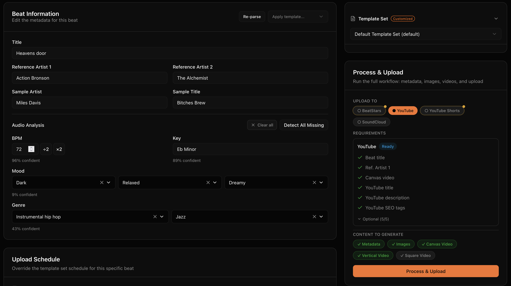
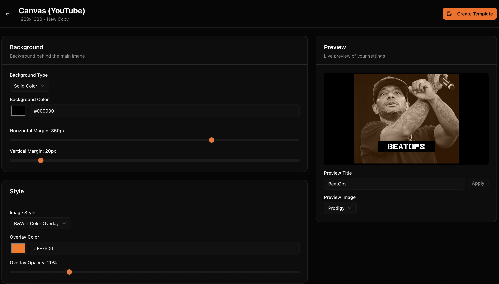
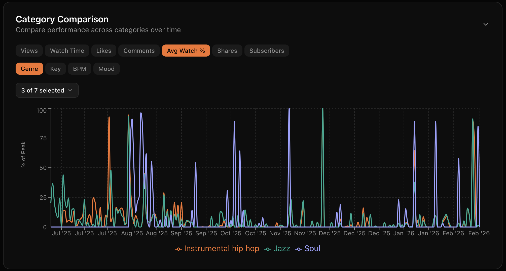
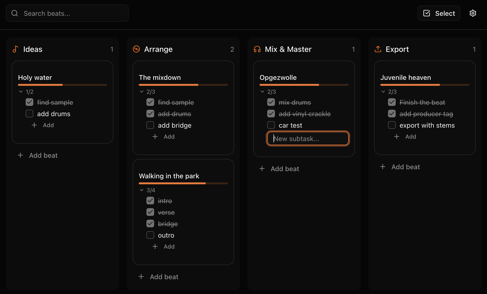

# BeatOps

**The all-in-one tool for beat producers. Upload, brand, analyze, and manage your catalog.**

## What is BeatOps?

BeatOps is a desktop app built for type beat producers who want to spend less time on admin and more time making music. It handles the entire workflow: audio analysis, thumbnail generation, video creation, SEO-optimized metadata, multi-platform uploads, analytics, and production tracking.

Everything runs locally on your computer. Your beats never leave your machine until you explicitly upload them.

## Upload everywhere from one place

Fill in your beat info, select your platforms, and hit Process & Upload. BeatOps handles metadata, images, videos, and distribution in one go.

## Professional branding without design skills

Create consistent thumbnails across all formats. Choose a visual style, set your colors, and every beat gets the same professional look.

## Know what your audience wants

Track performance across YouTube and SoundCloud. See which genres, keys, BPMs, and moods drive the most engagement. Find your hidden gems.

## Track every beat from idea to release

A kanban board built for music production. Drag beats through your workflow stages and always know what's ready to upload.

## All Features

- **Multi-Platform Upload** - YouTube, YouTube Shorts, BeatStars, and SoundCloud from one workflow
- **Audio Analysis** - Automatic BPM, key, mood, and genre detection
- **Video Creation** - Generate videos in landscape, vertical, and square formats
- **Thumbnail Generation** - Professional thumbnails with templates and branding
- **Template System** - Reusable templates for titles, descriptions, tags, and visuals
- **Analytics Dashboard** - Cross-platform performance tracking with Performance Insights
- **Kanban Board** - Visual production pipeline with customizable columns
- **Stem Management** - Auto-detect, link, and zip stems for BeatStars
- **Batch Processing** - Process and upload multiple beats at once
- **Scheduling** - Set upload days and times per platform

## Download

| Platform | Download |
|----------|----------|
| macOS (Apple Silicon) | [Download DMG](https://github.com/snarebes/BeatOps/releases/latest) |
| Windows | [Download EXE](https://github.com/snarebes/BeatOps/releases/latest) |

Or visit the [download page](https://beatops.io/download.html) for more options.

## Links

- [Website](https://beatops.io)
- [Features](https://beatops.io/features.html)
- [Pricing](https://beatops.io/pricing.html)
- [Help](https://beatops.io/help.html)

## License

BeatOps is proprietary software. All rights reserved. See [LICENSE](LICENSE) for details.
