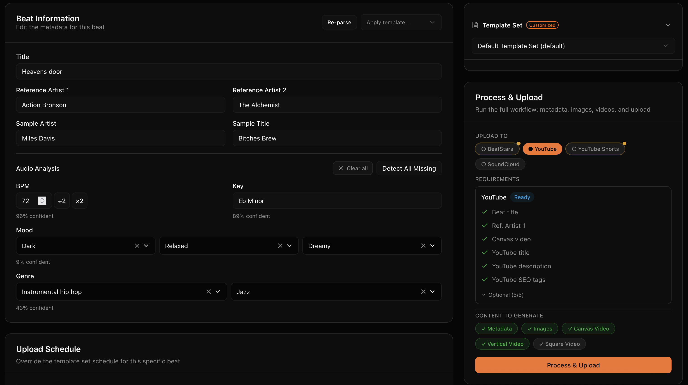
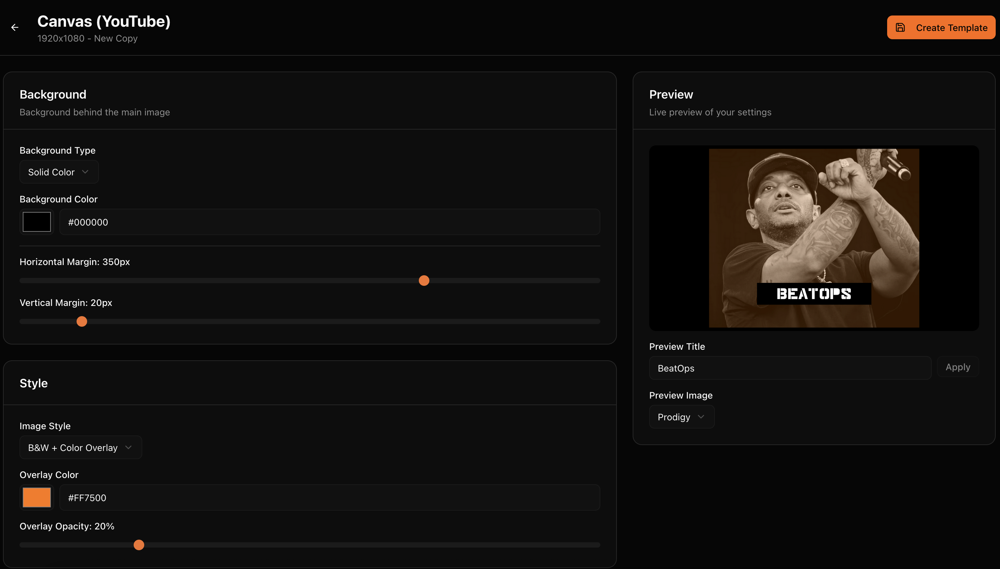
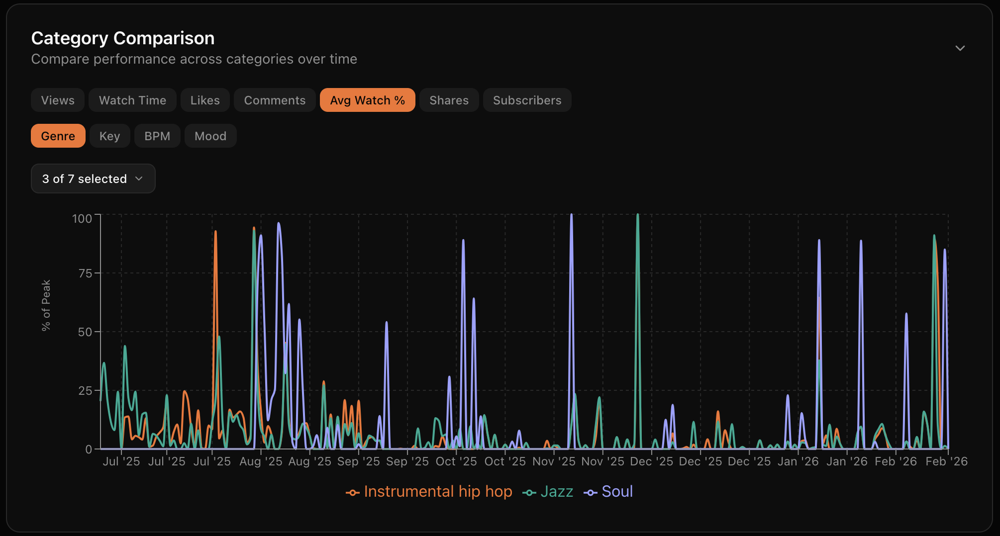
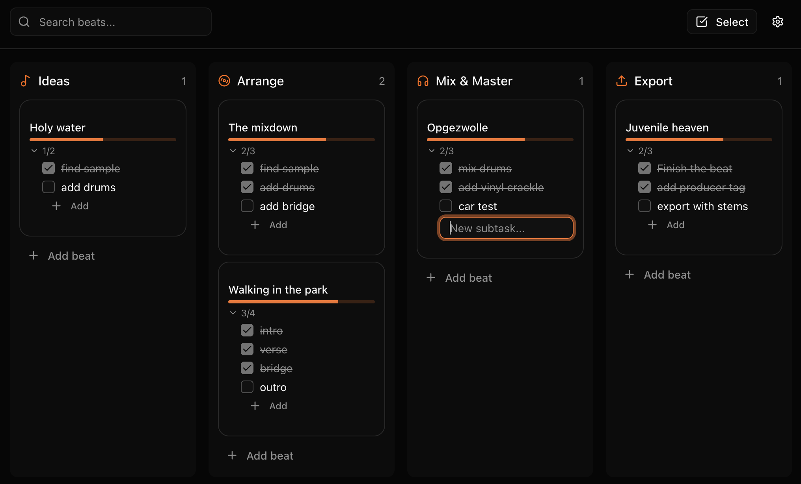

# BeatOps

**Producers make beats. BeatOps handles the rest.**

The all-in-one platform for automated type beat releases across YouTube, BeatStars, and SoundCloud, straight from your DAW. Auto-generated thumbnails, videos, and metadata, so releasing a beat takes a few clicks instead of an afternoon.

[](https://github.com/snarebes/BeatOps/releases/latest)
[](https://github.com/snarebes/BeatOps/releases/latest)
[](LICENSE)

## What is BeatOps?

BeatOps is a desktop app built for type beat producers who want to spend less time on admin and more time making music. It handles the entire workflow: audio analysis, thumbnail generation, video creation, SEO-optimized metadata, multi-platform uploads, analytics, and production tracking.

Everything runs locally on your computer. Your beats never leave your machine until you explicitly upload them.

## Three ways to publish

Start in your DAW, in the app, or hand it to an AI agent. Wherever you start, the same release comes out.

- **From your DAW:** BeatOps Release is a VST3/AU plugin on your master bus. Bounce like you always do, hit Save & Publish, and the beat is on its way. See [the plugin](https://beatops.io/plugin.html).
- **In the app:** Point BeatOps at your beats folder. It analyzes what it finds, then builds the artwork, video, and metadata for each one.
- **With an AI agent:** BeatOps speaks CLI and MCP, so it plugs straight into Claude Code, Codex, Cursor, or any other AI tool. Ask in plain text and the agent handles the release.

## Publish from inside your DAW

BeatOps Release is a VST3/AU plugin that sits on your master bus and captures your beat the moment you bounce, then publishes it to YouTube, YouTube Shorts, BeatStars, and SoundCloud. You do not leave the DAW and you do not re-import the exported file: the export itself is the trigger.

- Captures a bit-perfect copy of your mix. Your exported WAV is never modified.
- Stems come along in the same bounce, captured sample-aligned with the master. Real authored busses, not AI-separated guesses.
- Your producer tag is captured at the exact sample position you placed it, mixed into the preview only, never into the clean WAV.
- BPM is read from the DAW transport, so it is exact rather than estimated.
- Tested in FL Studio, Ableton Live, Logic Pro, REAPER, Cubase, Studio One, and GarageBand, on macOS and Windows.
- Included on every plan, the free one too.

## Upload everywhere from one place

Fill in your beat info, select your platforms, and hit Process & Upload. BeatOps handles metadata, images, videos, and distribution in one go.



## Professional branding without design skills

Create consistent thumbnails across all formats. Choose a visual style, set your colors, and every beat gets the same professional look.



## Know what your audience wants

Track performance across YouTube and SoundCloud. See which genres, keys, BPMs, and moods drive the most engagement. Find your hidden gems.



## Track every beat from idea to release

A kanban board built for music production. Drag beats through your workflow stages and always know what's ready to upload.



## Release with an AI agent

BeatOps ships with a CLI and an MCP server, both included with the desktop app. The app must be running (they connect to the local backend).

```bash
# List your beats
beatops list

# Full pipeline: analyze, generate video, and upload
beatops pipeline "my beat" --to youtube --yes
```

Add the MCP server to Claude Desktop (`claude_desktop_config.json`) or Claude Code (`.mcp.json`):

```json
{
  "mcpServers": {
    "beatops": {
      "command": "beatops-mcp"
    }
  }
}
```

Then ask your agent to release a beat, check status, or run the full pipeline. See the [CLI setup](https://beatops.io/help/cli-setup.html) and [MCP setup](https://beatops.io/help/mcp-setup.html) guides.

## All Features

- **DAW Plugin:** VST3/AU plugin that captures your beat at export and publishes it without leaving the DAW
- **Multi-Platform Upload:** YouTube, YouTube Shorts, BeatStars, and SoundCloud from one workflow
- **Audio Analysis:** Automatic BPM, key, mood, and genre detection
- **Video Creation:** Generate videos in landscape, vertical, and square formats
- **Thumbnail Generation:** Professional thumbnails with templates and branding
- **Template System:** Reusable templates for titles, descriptions, tags, and visuals
- **Analytics Dashboard:** Cross-platform performance tracking with Performance Insights
- **Kanban Board:** Visual production pipeline with customizable columns
- **Stem Management:** Auto-detect, link, and zip stems for BeatStars
- **Batch Processing:** Process and upload multiple beats at once
- **Scheduling:** Set upload days and times per platform
- **CLI and MCP:** Drive the whole workflow from the command line or an AI agent

## Download

| Platform | Download |
|----------|----------|
| macOS (Apple Silicon) | [Download DMG](https://github.com/snarebes/BeatOps/releases/latest) |
| Windows | [Get from Microsoft Store](https://apps.microsoft.com/detail/9NQTDNPDQRLT) |

The Windows Store build is verified by Microsoft, installs without security warnings, and updates automatically. Prefer a direct installer? Grab the [.exe from the latest release](https://github.com/snarebes/BeatOps/releases/latest) (not code-signed yet, so Windows SmartScreen warns on first run).

Or visit the [download page](https://beatops.io/download.html) for more options.

## Links

- [Website](https://beatops.io)
- [Features](https://beatops.io/features.html)
- [DAW Plugin](https://beatops.io/plugin.html)
- [Pricing](https://beatops.io/pricing.html)
- [Help](https://beatops.io/help.html)
- [PyPI Package](https://pypi.org/project/beatops/)

## License

BeatOps is proprietary software. All rights reserved. See [LICENSE](LICENSE) for details.
